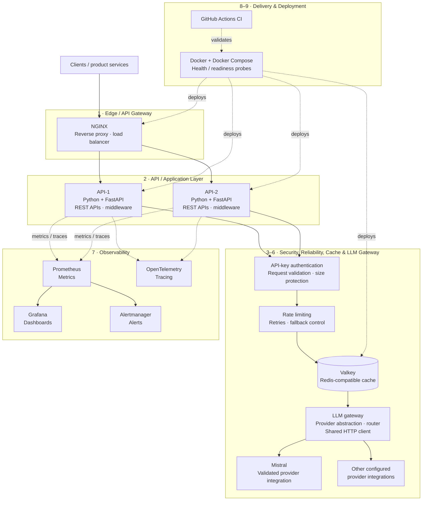
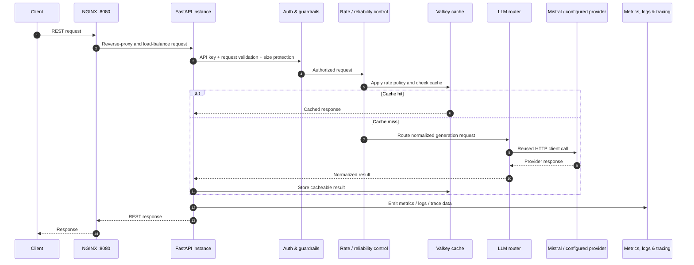
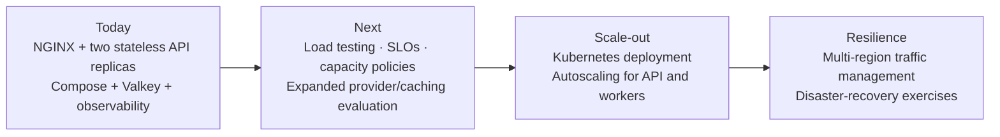

# NEXUS AI Platform

> **A production-oriented LLM Gateway and LLMOps platform for secure, observable, resilient AI inference.**

NEXUS turns model access into a governed platform capability instead of embedding provider-specific SDK calls across product services. It places API security, traffic control, cache-aware execution, provider abstraction, health checks, and operational telemetry behind one clean request boundary.

**What is validated:** two API replicas behind NGINX, Valkey-backed cache readiness, authenticated Mistral generation, Prometheus/Grafana/Alertmanager availability, OpenTelemetry/tracing integration, and passing GitHub Actions CI. NEXUS is deliberately positioned as a production-oriented foundation—not as a claim of complete enterprise-scale or multi-region readiness.

## Why this project matters

LLM features create a new operational surface area: variable latency, external provider failures, token-driven cost, rate limits, sensitive inputs, and fragmented observability. A basic AI demo hides these concerns inside an endpoint. NEXUS treats them as first-class infrastructure concerns.

The result is a practical control plane between applications and model providers:

- **Decoupled applications:** REST clients depend on a stable gateway contract, not a provider SDK.
- **Resilient inference:** routing, retry, and fallback responsibilities are centralized rather than reimplemented per feature.
- **Controlled cost and latency:** caching, connection reuse, rate limiting, and routing reduce avoidable work and provider pressure.
- **Operational visibility:** metrics, dashboards, alerting, and traces make request behavior observable rather than opaque.
- **Scale-out posture:** stateless API replicas are load balanced now; Kubernetes, autoscaling, and multi-region operation remain an explicit next step.

## Architecture at a glance

## End-to-end request flow

The synchronous path is intentionally narrow: the edge distributes traffic, FastAPI applies policy, cache and routing determine whether external inference is required, and instrumentation records what occurred. This separation keeps application code focused on the API contract while centralizing cross-cutting AI platform behavior.

## Layered engineering design

| Layer | Implemented technology / capability | Why it is here |
| --- | --- | --- |
| **1. Edge / API Gateway** | NGINX reverse proxy and load balancer | Provides one ingress point and distributes requests across API replicas. |
| **2. API / Application** | Python, FastAPI, middleware, REST APIs | FastAPI provides an explicit HTTP contract and a clean middleware boundary for shared platform concerns. |
| **3. Security & Guardrails** | API-key authentication, request validation, request-size protection | Rejects unauthorized or malformed/oversized traffic before it reaches model execution. |
| **4. Reliability & Control** | Rate limiting, retries, provider routing/fallback architecture | Bounds abusive traffic and isolates provider instability behind one consistent control layer. |
| **5. Cache** | Valkey, Redis-compatible cache, semantic-cache architecture | Creates a low-latency reuse path and a foundation for reducing eligible repeat provider calls. |
| **6. LLM Gateway** | Provider abstraction, routing, shared HTTP client, Mistral and other configured integrations | Removes provider SDK coupling and reuses connections rather than opening one per inference. |
| **7. Observability** | Prometheus, Grafana, Alertmanager, OpenTelemetry/tracing | Converts API/LLM activity into metrics, dashboards, alerts, and traceable request context. |
| **8. Infrastructure** | Docker, Docker Compose, health/readiness probes, API-1/API-2 | Produces repeatable local/deployment topology and validates individual component availability. |
| **9. CI/CD** | GitHub Actions CI | Automates validation before changes are accepted. |

## Engineering principles implemented

### Horizontal scaling and failure isolation

NEXUS runs **two horizontally scaled FastAPI API instances**—`API-1` and `API-2`—behind NGINX. The API layer is designed as a stateless request-processing tier: traffic can be distributed at the edge while shared cache state is held in Valkey rather than in a specific API replica. This is the right scale-out boundary for a gateway service and avoids coupling client availability to a single process.

Load balancing does not eliminate provider failure, so the reliability layer keeps provider-specific concerns out of the edge and API contract. The architecture centralizes rate limiting, retry behavior, provider routing, and fallback paths, limiting the blast radius of a slow or failing upstream integration.

### Latency, connection reuse, and cost discipline

The platform is optimized around eliminating avoidable work rather than claiming unmeasured performance numbers:

- **Valkey/Redis-compatible caching** provides a fast response path when an eligible request can be served without a new provider call.
- **Semantic-cache architecture** provides a path to reuse meaningfully equivalent requests, subject to the cache policy and correctness requirements.
- **Shared HTTP client usage** enables connection reuse for outbound provider traffic, avoiding needless connection setup per request.
- **Provider abstraction and routing** keep model/provider selection centralized, creating a single place to evolve latency, quality, and cost policy.
- **Rate limiting and request-size protection** protect application and provider capacity from runaway clients before costs are incurred.

These are structural cost/performance controls. This project intentionally does **not** claim cache-hit rates, latency reductions, throughput, token savings, or provider cost savings without a benchmark or usage dataset.

### Configuration and separation of concerns

Runtime configuration is environment-variable driven, keeping credentials and environment-specific settings outside the application contract. NGINX handles ingress and balancing; FastAPI owns the HTTP API and middleware; guardrails and control logic govern access/execution; Valkey serves cache concerns; the LLM gateway owns provider integration; and the observability stack records operational behavior. This is a cleanly separated design that makes individual layers easier to test, replace, and evolve.

## Reliability controls

| Control | Implemented role | Operational value |
| --- | --- | --- |
| NGINX load balancing | Routes ingress traffic across API-1 and API-2 | Avoids a single API process being the sole serving path. |
| API health endpoint | `/v1/health` | Provides a direct liveness check for API availability. |
| Readiness endpoint | `/v1/ready` | Verifies the API is ready to serve and reports cache availability. |
| Container health/readiness probes | Docker Compose deployment checks | Makes component health explicit in the deployment topology. |
| Rate limiting | Controls request admission | Protects API/provider capacity and limits noisy-client impact. |
| Retries + fallback architecture | Central provider-failure handling design | Keeps resilience behavior consistent at the LLM boundary. |
| Provider abstraction | Router separates callers from individual providers | Enables controlled provider selection and fallback evolution. |

Retry and fallback controls are intentionally architectural safeguards, not a promise that every request can always be completed. Fallback behavior must remain compatible with the request’s model, feature, and response requirements.

## Security and guardrails

NEXUS enforces API-key authentication before generation and applies request validation plus request-size protection at the API boundary. This design guards scarce downstream capacity and provides a clear security choke point for future identity, authorization, and tenant policy evolution.

| Control | Current protection |
| --- | --- |
| API-key authentication | Limits generation access to authenticated callers. |
| Request validation | Rejects invalid API input before it reaches routing or a provider. |
| Size protection | Limits oversized requests before they consume cache, API, or provider capacity. |
| Rate limiting | Constrains request admission to protect shared resources. |
| Environment-based configuration | Keeps deploy-time configuration separate from application code. |

No claim is made here about enterprise IAM, fine-grained authorization, data residency, secret-management tooling, or compliance certification; those are future hardening areas.

## Observability: operating an AI gateway

AI systems require visibility into both platform behavior and external inference behavior. NEXUS integrates:

- **Prometheus** for scrapeable metrics;
- **Grafana** for visualizing operational signals;
- **Alertmanager** for alert delivery and routing; and
- **OpenTelemetry/tracing** for request-level observability.

After a successful authenticated generation, LLM metrics increment—validating that the generation path is visible to the monitoring layer. The observability stack is running, but this README does not claim defined SLOs, alert thresholds, retention policies, a complete dashboard catalogue, or benchmark-derived service-level objectives.

## Validation evidence

The following integration results have been verified for the current system:

| Check | Verified result |
| --- | --- |
| API replicas | Both API instances are healthy. |
| Edge ingress | NGINX serves traffic on port `8080`. |
| Cache | Valkey is healthy. |
| API liveness | `GET /v1/health` returns `200`. |
| API readiness | `GET /v1/ready` returns `200` with cache status OK. |
| Authenticated inference | `POST /v1/generate` successfully reaches Mistral. |
| Metrics | LLM metrics increment after generation. |
| Monitoring | Prometheus, Grafana, and Alertmanager are running. |
| Delivery verification | GitHub Actions CI is passing. |

These are functional integration signals, not performance benchmarks. No RPS, latency percentile, uptime, cache-hit rate, failure rate, cost, or scale-limit number is asserted.

## Production-readiness snapshot

| Capability | Status | Scope of the claim |
| --- | --- | --- |
| Containerized deployment | ✅ Validated | Docker Compose-based topology with NGINX, two API replicas, cache, and monitoring services. |
| Stateless API scale-out | ✅ Implemented | NGINX distributes traffic to API-1/API-2. |
| Health/readiness checks | ✅ Validated | `/v1/health` and cache-aware `/v1/ready` return `200`. |
| Authentication and input guardrails | ✅ Implemented | API key, validation, and size protection at the API boundary. |
| Provider gateway | ✅ Validated | Authenticated generation reaches Mistral through the LLM gateway. |
| Cache foundation | ✅ Validated | Valkey is healthy; cache and semantic-cache architecture are part of the request path/design. |
| Monitoring and alerting stack | ✅ Running | Prometheus, Grafana, Alertmanager, and tracing integration are present. |
| Automated CI | ✅ Passing | GitHub Actions CI. |
| Kubernetes / autoscaling | ⏳ Future | Not implemented or claimed. |
| Multi-region / disaster recovery | ⏳ Future | Not implemented or claimed. |
| Enterprise-wide readiness | ❌ Not claimed | Requires workload-specific security, SLO, DR, and scale validation. |

## Future scalability roadmap

The current architecture creates clean seams for evolution, but these are roadmap items—not delivered capabilities:

1. **Measure before scaling:** add reproducible load, failure, cache-quality, and cost tests; publish only the results the suite can reproduce.
2. **Orchestrate when justified:** move the stateless API tier to Kubernetes and introduce autoscaling based on observed traffic and saturation.
3. **Strengthen the control plane:** mature provider health policy, route evaluation, budget controls, alert/SLO definitions, and operational runbooks.
4. **Expand geographic resilience deliberately:** add multi-region routing, data-boundary controls, replication, and disaster-recovery validation only when requirements demand them.

## What a recruiter should take away

NEXUS demonstrates the engineering mindset required to turn LLM access into dependable infrastructure: layered boundaries, provider independence, explicit failure controls, cache-aware execution, containerized multi-replica deployment, and observability that extends through inference. It is not a chat UI or a thin model wrapper—it is a focused LLM gateway/LLMOps foundation built around the operational realities that determine whether AI features can be safely scaled.

## License

Licensed under the [MIT License](LICENSE).
